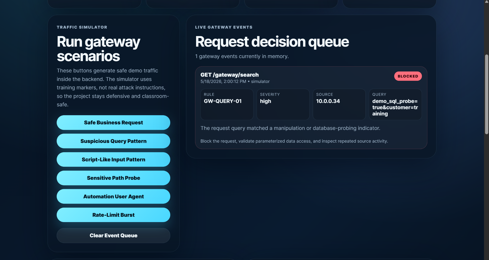
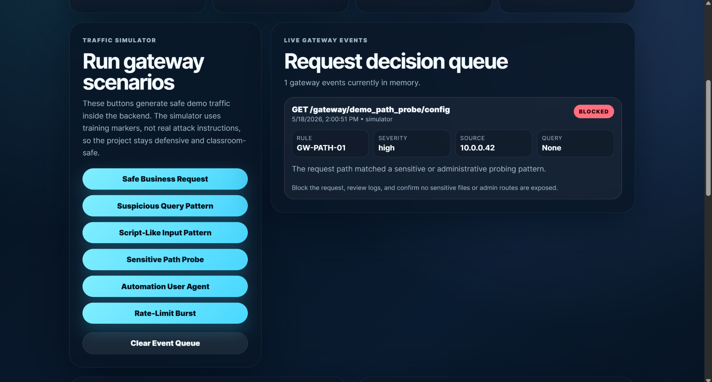
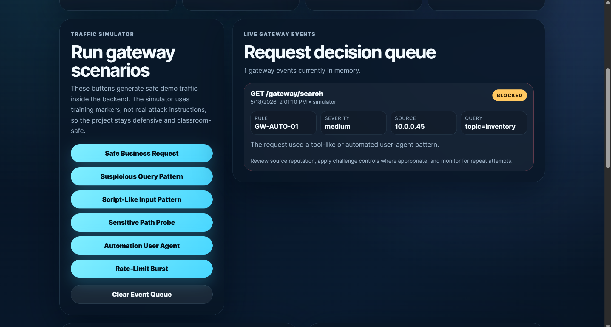
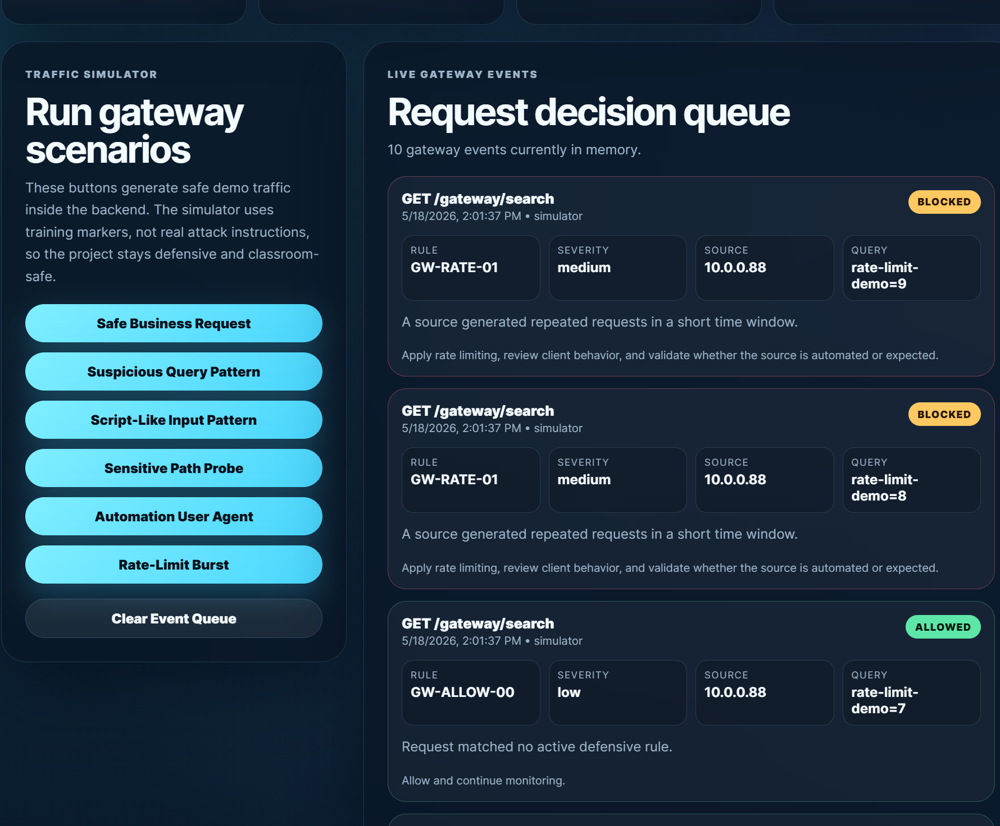

# GateWatch API Security & Traffic Defense Console

GateWatch is a defensive API security gateway console built with Spring Boot. It inspects inbound request patterns, classifies suspicious traffic, injects defensive response headers, records gateway events, and presents request decisions through a polished security operations dashboard.

This project upgrades the original `Web-Request-Security-Gateway` into a more complete Cloud + Security Operations portfolio system with a live traffic simulator, event queue, rules engine, metrics API, hardened response headers, Docker support, and CI validation.

## Project Preview

<table>
  <tr>
    <td width="50%">
      
    </td>
    <td width="50%">
      
    </td>
  </tr>
  <tr>
    <td width="50%">
      
    </td>
    <td width="50%">
      
    </td>
  </tr>
  <tr>
    <td width="50%">
      
    </td>
    <td width="50%">
      
    </td>
  </tr>
</table>

## Overview

GateWatch is designed to feel like an internal platform security tool used by cloud support, DevOps support, security operations, and application support teams. It demonstrates how a defensive gateway can inspect traffic before it reaches application routes, create operational visibility, and expose useful metrics for review.

## Real-World Use Case

Cloud and platform teams often need to answer:

- Which requests are being allowed or blocked?
- Which defensive rules are triggering?
- Are suspicious request patterns appearing repeatedly?
- Are response security headers active?
- Can gateway activity be summarized for support and security teams?
- Is the service ready for Dockerized or cloud deployment?

GateWatch turns those concerns into a working Spring Boot dashboard and API.

## Safe Demo Boundary

GateWatch is defensive and educational. The simulator uses safe training markers instead of real attack instructions. It is intended for:

- Owned applications
- Local labs
- Internal demos
- Portfolio review
- Defensive security learning
- Cloud and DevOps support demonstrations

It should not be used for unauthorized testing.

## Cloud + Security Relevance

This project supports cloud and security operations because it demonstrates:

- API gateway thinking
- Request inspection
- Traffic decision logging
- Security event triage
- Header hardening
- Rules-based filtering
- Rate-limit simulation
- Health and metrics endpoints
- Docker readiness
- CI validation
- Future fit for cloud edge security and AI-assisted event analysis

## Key Features

- Java Spring Boot backend
- Built-in responsive frontend dashboard
- Defensive request inspection filter
- Response security header filter
- Live traffic simulator
- Gateway event queue
- Rules engine view
- Header hardening review
- Metrics API
- JSON report endpoint
- Dockerfile
- docker-compose support
- GitHub Actions CI

## API Endpoints

| Method | Endpoint | Purpose |
|---|---|---|
| GET | `/` | GateWatch dashboard |
| GET | `/api/health` | Service health check |
| GET | `/api/metrics` | Gateway metrics and readiness score |
| GET | `/api/events` | Recent request decision events |
| POST | `/api/events/clear` | Clear in-memory event queue |
| GET | `/api/rules` | Active defensive rules |
| GET | `/api/headers` | Response hardening controls |
| GET | `/api/report` | JSON report containing metrics, rules, headers, and events |
| POST | `/api/simulate/allowed` | Simulate safe business traffic |
| POST | `/api/simulate/suspicious-query` | Simulate suspicious query pattern |
| POST | `/api/simulate/script-like` | Simulate script-like input pattern |
| POST | `/api/simulate/path-probe` | Simulate sensitive path probe |
| POST | `/api/simulate/automation` | Simulate automation-style client |
| POST | `/api/simulate/rate-limit` | Simulate request burst behavior |
| GET | `/gateway/search` | Demo gateway-protected route |
| GET | `/gateway/orders/status` | Demo gateway-protected route |

## Tech Stack

- Java 11
- Spring Boot
- Spring Web
- Spring Boot Actuator
- HTML
- CSS
- JavaScript
- Docker
- GitHub Actions

## Run Locally

```powershell
cd "C:\github-audit\Web-Request-Security-Gateway"

if (Test-Path ".\mvnw.cmd") {
    .\mvnw.cmd spring-boot:run
} else {
    mvn spring-boot:run
}

